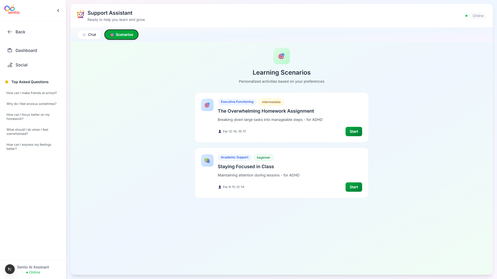

For the **root README.md**, you don’t need to repeat the detailed project structure of the frontend and backend since each subproject already has its own README. At the root, the goal is to **give a high-level overview**, highlight key features, AI methods, tech stack, screenshots, and optionally a placeholder for a video.

Here’s a fully copy-pasteable `README.md` for the **root folder** of Sentio, following your instructions:

---

# 🌟 Sentio – AI-Powered Neurodiversity Support Platform

Sentio is an **AI-driven support platform** designed for neurodiverse individuals, particularly children and teenagers with conditions like **ASD (Autism Spectrum Disorder)** and **ADHD**. It combines **personalized AI assistance**, **scenario-based learning**, and **preference-driven experiences** to provide engaging therapeutic support. The platform consists of a **Next.js frontend** and a **FastAPI backend** that work seamlessly to deliver interactive learning and personalized recommendations.

---

## ✅ Key Features

* **Personalized AI Assistant:**
  Uses **RAG-based architecture** (Retrieval Augmented Generation) with **LangChain sequential and parallel chains** to generate personalized responses based on user preferences. Semantic search on the knowledge base is performed using **sentence-transformer embeddings**.

* **Preference-Driven Personalization:**
  Users can fill out detailed preferences which the system uses to tailor responses, scenario recommendations, and learning activities.

* **Scenario-Based Learning:**

  * Learners are provided with **interactive learning modules** based on their preferences.
  * Scenarios cover domains like **emotional regulation, social skills, executive functioning, and adaptability training**.
  * **Semantic matching** is applied to ensure scenarios are relevant using **cosine similarity on embeddings**.

* **Frontend Capabilities:**

  * **Chat Interface:** Interactive AI-driven conversation with persistent chat history (**Zustand**).
  * **Dashboard & Progress Tracking:** Overview of user progress, recently recommended scenarios, and preferences.
  * **Preferences Form:** Collects detailed information to personalize experience.
  * **Social Corner:** Lightweight social interactions among users.
  * **Responsive & Modern UI:** Built with **Next.js, Tailwind CSS, ShadCN/UI components, and Framer Motion animations**.

---

## 📂 Tech Stack

**Frontend:** Next.js, React, Tailwind CSS, Zustand, Axios
**Backend:** FastAPI, Python, Pydantic, LangChain, GroqCloud LLM API, Sentence-Transformer embeddings
**State Management:** Persistent state with Zustand
**API Communication:** Axios for RESTful endpoints

---

## 📷 Screenshots

### Landing Page

### Chat Interface

### Dashboard

### Scenario Recommendations

### About Page

---

## 🔮 Future Enhancements

* Integrate persistent database storage for user data and scenarios.
* Multimedia support for scenarios including images and audio.
* Real-time collaboration features for therapists and users.
* Notifications and analytics dashboards for user engagement.

---

## 📄 License

MIT License
