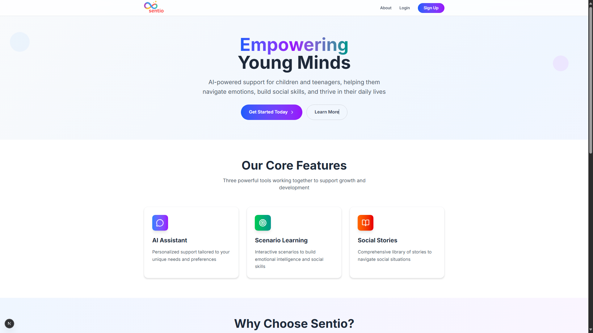
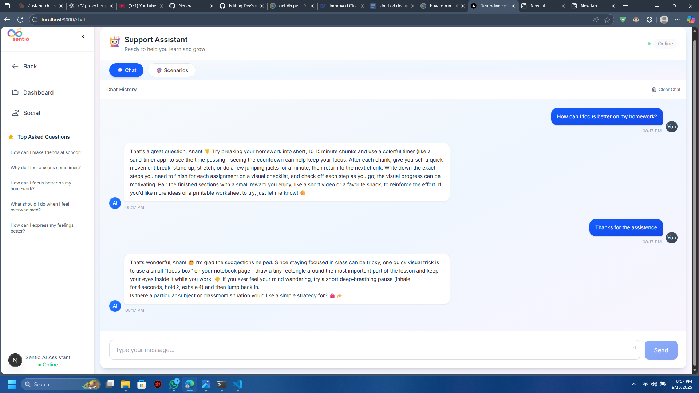
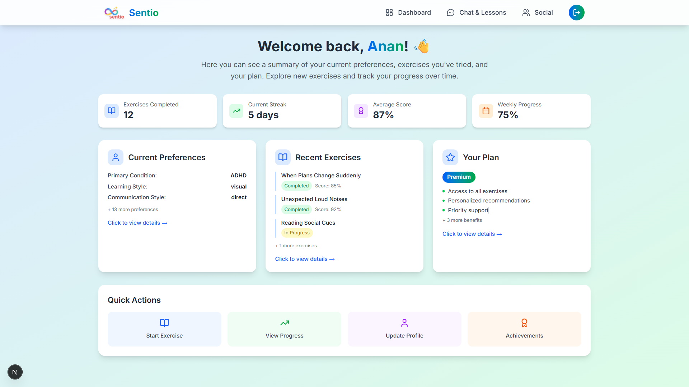
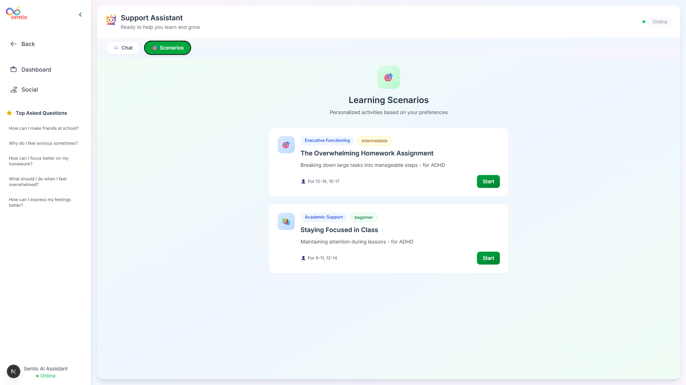
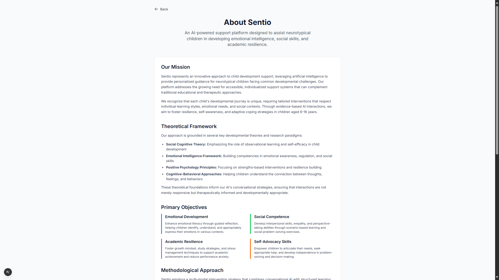

Perfect! Based on the details you provided, here’s a **fully copy-pasteable frontend `README.md`** for the Sentio project, written in the clean, technical style you like:

---

# 🌟 Sentio Frontend – AI-Powered Neurodiversity Support Platform

Sentio Frontend is a **Next.js-based web application** for the Sentio platform, designed to provide an interactive and personalized experience for neurodiverse users. It allows users to manage preferences, interact with a personalized AI chat assistant, explore scenario-based learning modules, and connect socially through a lightweight social corner. The frontend communicates with the FastAPI backend via **REST API endpoints**, stores user state persistently using **Zustand**, and is styled with **Tailwind CSS** and **ShadCN/UI components** with smooth **Framer Motion animations**.

---

## ✅ Key Features

* **User Authentication:** Login and registration pages with protected routes.
* **Preference Management:** Dynamic forms to collect detailed user preferences stored in the backend.
* **Personalized Chat Interface:** AI assistant powered by the backend with **persistent chat history** using Zustand.
* **Scenario Recommendations:** Displays recommended learning modules based on user preferences and semantic search.
* **Dashboard:** Overview of user progress, preferences, and recently recommended scenarios.
* **Social Corner:** Allows light social interactions between users.
* **Responsive Design:** Fully responsive UI for desktop, tablet, and mobile screens.
* **State Management:** Centralized with **Zustand**, including chat history persistence and preference state.
* **API Communication:** Axios used for REST calls with proper error handling.
* **Interactive UI Components:** Reusable components including chat, scenario interface, modals, forms, and navbar.

---

## 📂 Project Structure

```
src/
├── app/
│   ├── about/page.tsx
│   ├── api/
│   │   └── scenarios/
│   │       ├── recommend/route.ts
│   │       └── search/route.ts
│   ├── auth/
│   │   ├── login/page.tsx
│   │   └── register/page.tsx
│   ├── chat/page.tsx
│   ├── dashboard/page.tsx
│   ├── preferences/page.tsx
│   ├── social/page.tsx
│   ├── globals.css
│   ├── layout.tsx
│   └── page.tsx
├── assets/
│   ├── bot.png
│   └── logo.png
├── components/
│   ├── ChatInterface.tsx
│   ├── LLMMessageRenderer.tsx
│   ├── Navbar.tsx
│   ├── PreferencesForm.tsx
│   ├── ScenarioInterface.tsx
│   └── ScenarioLearningModal.tsx
├── contexts/
│   └── PreferencesContext.tsx
├── lib/
│   └── api.ts
└── stores/
    ├── chatStore.ts
    └── preferenceStore.ts
```

---

## 🖼 Screenshots

### Landing Page



### Chat Interface



### Dashboard



### Scenario Recommendations



### About Page



---

## 🛠 Tech Stack

**Frontend:** Next.js 15.5.0, React 18, Tailwind CSS, ShadCN/UI, Framer Motion
**State Management:** Zustand for global state and persistence
**API Communication:** Axios for RESTful requests
**Routing:** Next.js App Router with protected routes for authenticated users

---

## ⚡ Installation

1. Clone the repository:

```bash
git clone <frontend-repo-url>
cd sentio-frontend
```

2. Install dependencies:

```bash
npm install
```

3. Set environment variables if needed (e.g., API base URL).

4. Run the development server:

```bash
npm run dev
```

5. Open [http://localhost:3000](http://localhost:3000) to view in the browser.

---

## 🔗 API Endpoints

* **Preferences:** POST `/api/save-preferences` – Save user preferences
* **Scenarios Recommend:** GET `/api/scenarios/recommend` – Fetch recommended scenarios
* **Scenarios Search:** GET `/api/scenarios/search` – Search scenarios
* **Chat:** POST `/api/chat/send` – Send user message to AI assistant
* **Authentication:** POST `/api/auth/login` and `/api/auth/register` – User auth

---

## 🏗 Implementation Details

* **State Management:** Zustand stores user preferences and chat history with persistence in `localStorage`.
* **Chat Interface:** Reusable `ChatInterface` and `LLMMessageRenderer` components handle real-time message rendering.
* **Scenario Recommendations:** `ScenarioInterface` displays scenario cards with relevance scores, interactive modals, and filtering options.
* **Forms & Validation:** `PreferencesForm` collects detailed user preferences and submits via Axios.
* **Routing:** Next.js App Router manages public and private routes with `layout.tsx` handling global layout.
* **Styling:** Tailwind CSS with ShadCN components ensures modern minimal UI, responsive layout, and smooth animations.

---

## 🔮 Future Improvements

* Integrate real backend with persistent storage.
* Add multimedia support for scenarios.
* Implement real-time notifications for social interactions.
* Enhance analytics and progress tracking dashboards.
* Add multi-user collaboration features for admins/therapists.

---

## 📄 License

MIT License

